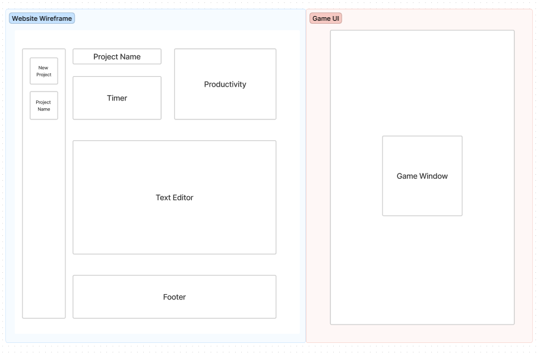
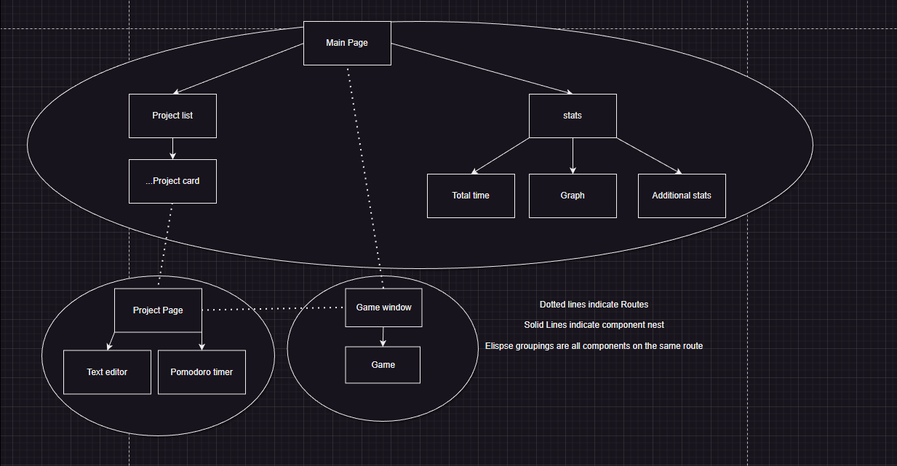

Group Project

A one sentence description of your app
A productivity-focused text editor with a built in Pomodoro sequencer

User stories
Lets say someone is having trouble focusing or getting burnt out with their work. Their troubles will be no more when they use this pomodoro sequencer text editor! This productivity app allows you to get work done, and then at 5 minute intervals, forces you to take a break to play games. This will allow the user a much needed break from their work.

Core Deliverables-

    1.Simple NotepadLike editor(State of words typed each session is taken)-1st route
    2.Game pops up every 5 min(Random game selected on start via array of games)-2nd route
    3.Project Routes-3rd route

Stretch-

    1.Extension
    2.Add multiple games
    3.Multiplayer

Pomodoro sequencer
The user will be able to create a pomodoro timer during their project that automatically launches a game for (5?) minutes

Wireframes (Figma, DrawIO, etc.)
./main.drawio

Github Link

https://github.com/ekollie/Phase-2-Project

